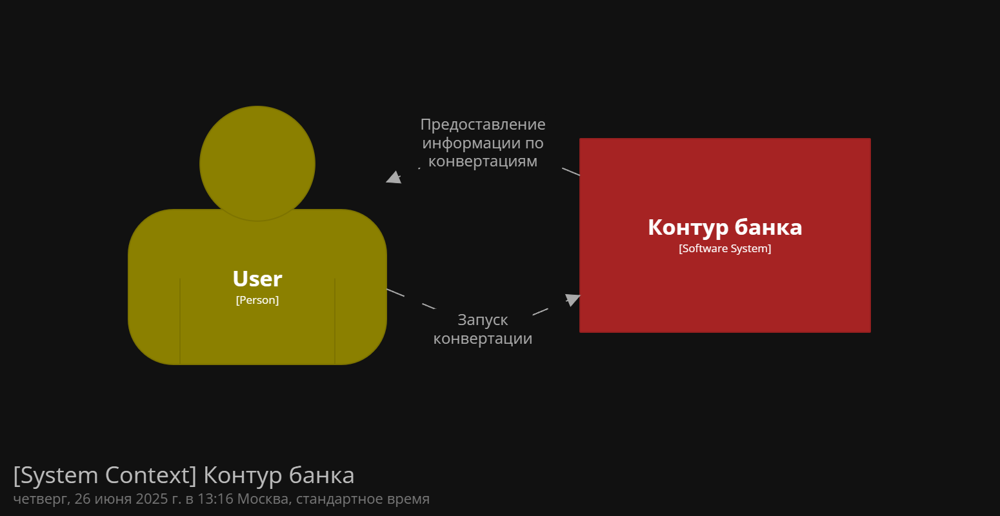
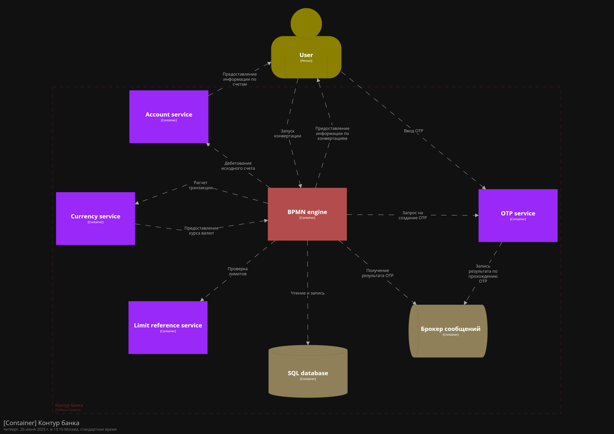
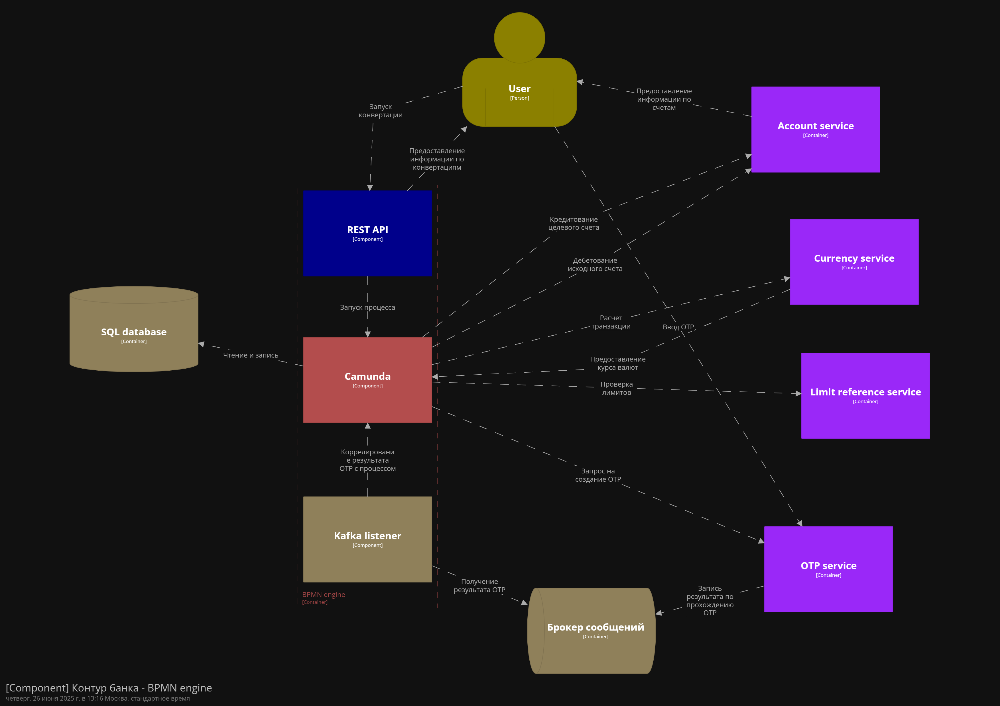

# Camunda demo

Демонстрационный проект с BPMN движком Camunda

Представлен сам BPMN движок с mock сервисами, отдельный микросервис account-service и webui для демонстрации.

Функционал - преобразование валют путем снятия денег с одного счета и пополнение другого счета пользователя. Транзакции объединены в распределенную с Saga в BPMN процессе.

## Локальный запуск

- Запустить Docker engine
- Запустить bpmn-engine (Spring boot run configuration) с профилем ```local``` и working directory ```./bpmn-engine```
- Запустить account-service (Spring boot run configuration) с профилем ```local``` и working directory
  ```./account-service```
- Выполнить ```npm install``` в директории ```./demo-webui```
- Выполнить ```npm generate:api-account-service``` в директории ```./demo-webui```
- Выполнить ```npm generate:api-bpmn-engine``` в директории ```./demo-webui```
- Выполнить ```npm start``` в директории ```./demo-webui```

Все окружение будет запущено автоматически в Docker

## Excamad

1. Для использования excamad (локально) перейти по [ссылке](http://localhost:8081/)
2. В settings ввести в поле "URL Camunda Engine REST" http://localhost:8080/engine-rest
3. Нажать save

## Деплой BPMN

Есть множество способов деплоить диаграммы в Camunda. Приведены 2 способа: через Camunda modeler и автодеплой в spring
приложении

### Camunda modeler

1. Открыть одну из диаграмм из директории [bpmn](./bpmn)
2. Нажать кнопку "Deploy current diagram" в нижней панели программы
3. Ввести REST endpoint. В случае локальной разработки это http://localhost:8080/engine-rest
4. Нажать "Deploy"

### Автодеплой

1. Расположить диаграмму в директории [bpmn](./bpmn-engine/src/main/resources/bpmn) в ресурсах приложения
2. Запустить приложение

## C4

### Редактирование

- В директории [c4](./c4) находится [docker-compose](./c4/docker-compose-structurizr.yml) с structurizr
  и [dsl кодом диаграмм](./c4/dsl/workspace.dsl)
- Для запуска нужно выполнить ```docker compose -f ./c4/docker-compose-structurizr.yml up```
- [Код диаграмм](./c4/dsl/workspace.dsl)

### Диаграммы






